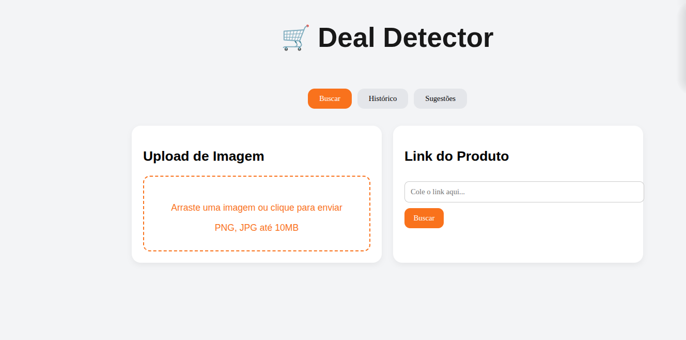

# Sistema de Autenticação Fullstack

Este projeto é uma aplicação fullstack com autenticação de usuários, desenvolvida com foco em aprendizado prático de desenvolvimento web moderno.


## Tecnologias utilizadas

### Backend
- FastAPI
- MongoDB
- Uvicorn
- Pydantic

### Frontend
- React
- Vite
- Axios
- React Router

---

## Funcionalidades

- Registro de usuários
- Login com autenticação
- Proteção de rotas (ProtectedRoute)
- Integração frontend ↔ backend via API
- Estrutura organizada em camadas

---

## Como rodar o projeto

### 1. Clonar o repositório
```bash
git clone <repo>
cd Projeto_DispositivosMoveisAndroid

### 2. Backend
cd backend
python -m venv .venv
source .venv/bin/activate  # Apenas para Linux
pip install -r requirements.txt

python -m uvicorn server:app --reload

### 3. Frontend 
cd frontend
npm install
npm run dev

### 4. MongoDB 
## No Linux:
Ligar o Mongo DB:
sudo systemctl start mongod 

Desligar o Mongo DB: 
sudo systemctl stop mongod

## No Windows (PowerShell):
Ligar o Mongo DB:
Start-Service MongoDB 

Desligar o Mongo DB:
Stop-Service MongoDB 
---

## Próximos passos:
- [x] Dashboard com dados reais
- [x] Aplicar a IA para fazer a busca por produtos 
- [x] Deploy (Render/Vercel)

---


